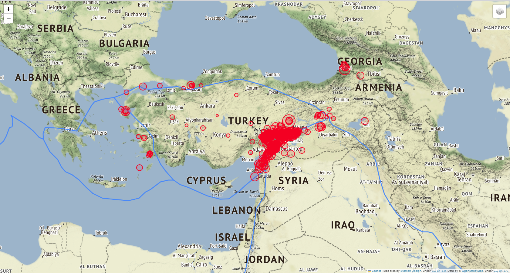
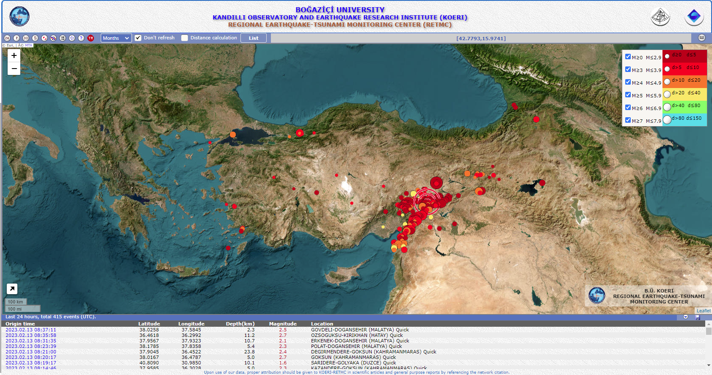

# Earthquakes in Turkey

by 

May God bless Turkish and Syrian people! 

All the lucks go to the rescuers.


## Project Settings

This project is to visualize the last 500 earthquakes happened in Turkey using Folium library and data from Kandilli Observatory.

The data updates can be obtained at: http://www.koeri.boun.edu.tr/scripts/lasteq.asp (the latest 500 rows of data only).

## Toolsets

1. Python + Folium lib + Web Scraping technology
2. Docker deployment

## What We Have Accomplished

1. Load up a CSV file based data set from 16 Jan 2023 from Kandilli Observatory.
2. Load up real-time dataset from Kandilli Observatory

## To be Done

1. Scraping multiple pages and Schedule such tasks every week
2. save dataframe to a local SQLite database for future use.
3. Running as a local Docker repo.
4. Deploy to public Cloud and private cloud.

## Pre-requisite Libraries

```
pip install -r requirements.txt
```

## Live Earthquake Map - Sample




## Credits

https://github.com/onurbasar/mapping-out-earthquakes-in-turkey

[KANDiLLi OBSERVATORY AND EARTHQUAKE RESEARCH INSTITUTE (1868)](http://www.koeri.boun.edu.tr/new/en)

[KANDiLLi Observatory Interactive Earthquake Map](http://udim.koeri.boun.edu.tr/zeqmap/)


## Copyrights

This project is for educational purposes only. The copyrights of the data and values are exclusively owned by Boğaziçi University and Kandilli Observatory.



## Versions

* v0.2.1.build.2023.02.27 - Merged Historic and real-time data into local database.
* v0.2.0.build.2023.02.26 - Historic dataset added.
* v0.1.0.build.2023.02.13 - Initial release - current 500 datapoints only  .